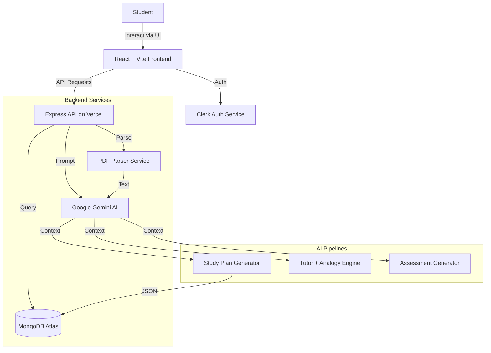

# Learn-Flow: Intelligent AI Study Planner & Tutor

  

> **"Optimizing Education through Artificial Intelligence"**

**Learn-Flow** is a comprehensive local-first ed-tech platform designed to democratize access to personalized education. By leveraging large language models (**Google Gemini 2.5**), it transforms static educational resources into dynamic, interactive, and personalized learning experiences.

Unlike traditional LMS (Learning Management Systems) that essentially act as file repositories, Learn-Flow actively parses content, understands the student's timeline, and constructs a pedagogical strategy tailored to their specific exam schedule.

---

## 🏗️ System Architecture

Learn-Flow operates on a **Serverless-First Architecture** designed for scalability and low maintenance.



### Core Components

1.  **Frontend**: A high-performance SPA built with React 18, utilizing `Framer Motion` for fluid interactions and `TailwindCSS` for a responsive, dark-mode-first design system ("Webtrix").
2.  **API Gateway**: A Node.js/Express backend deployed as Vercel Serverless Functions. It handles request routing, validation, and orchestration of AI services.
3.  **Data Layer**: MongoDB Atlas serves as the persistence layer, storing user profiles, generated study plans, and progress metrics.
4.  **AI Orchestrator**: A specialized service layer that interfaces with Google's Gemini API, managing prompt engineering, context windowing, and response parsing.

---

## 🚀 Key Features In-Depth

### 1. 📄 Context-Aware Syllabus Parsing

The system doesn't just "read" text; it understands the structure of academic documents.

- **Algorithm**: Uses a custom buffer-based PDF parsing engine (deployable on read-only serverless environments) to extract raw text.
- **Extraction**: Identifies Units, Chapters, and Topic hierarchy using Regex patterns and AI validation.
- **Output**: Converts unstructured PDF data into structured JSON objects suitable for database queries.

### 2. 📅 Adaptive Study Scheduler

The core value proposition of Learn-Flow.

- **Input**: User's syllabus + Exam Date.
- **Processing**: The Planner Service calculates the "days remaining" and "total topics". It then uses a heuristic algorithm, enhanced by AI, to distribute topics intelligently.
- **Load Balancing**: Ensures that heavy topics are broken down and lighter topics are batched, preventing student burnout.

### 3. 🎓 The Interactive AI Tutor

A persistent chat interface that acts as a private professor.

- **Analogy Engine**: A unique feature that re-explains complex STEM concepts using relatable metaphors (e.g., explaining Voltage/Current using Water Pipes or Football strategies).
- **Persistent Memory**: The chat interface retains context within the session, allowing for follow-up questions and deeper exploration.
- **LaTeX Rendering**: Native support for mathematical notation ensures formulas are displayed correctly ($E = mc^2$).

### 4. ⚡ On-Demand Assessment Engine

- **Dynamic Quiz Generation**: Creates 5-question micro-quizzes on the fly based on the specific topic the user is studying.
- **Instant Feedback Loop**: Provides immediate grading and detailed explanations for incorrect answers, reinforcing learning.

---

## 🛠️ Technical Stack Breakdown

| Layer          | Technology              | Rationale                                                         |
| :------------- | :---------------------- | :---------------------------------------------------------------- |
| **Frontend**   | React 18, Vite          | High performance, rich ecosystem, fast build times.               |
| **Styling**    | Tailwind CSS            | Utility-first CSS for rapid, consistent UI development.           |
| **Animation**  | Framer Motion           | Production-ready animation library for React.                     |
| **Auth**       | Clerk                   | Secure, drop-in authentication handling session management.       |
| **Backend**    | Node.js, Express        | Non-blocking I/O ideal for handling AI API requests.              |
| **Database**   | MongoDB + Mongoose      | Flexible schema design for storing complex JSON study plans.      |
| **AI Model**   | Google Gemini 2.5 Flash | High speeds and massive context window for processing large PDFs. |
| **Deployment** | Vercel                  | Seamless CI/CD, global edge network, serverless functions.        |

---

<!-- ## 📸 Visual Tour

|                                **Smart Dashboard**                                |                                 **AI Tutor Chat**                                  |
| :-------------------------------------------------------------------------------: | :--------------------------------------------------------------------------------: |
|            _Track progress and view your daily schedule at a glance._             |                 _Chat with context-aware AI using fun analogies._                  |
|  |  |

|                              **Syllabus Upload**                              |                              **Micro-Quiz**                               |
| :---------------------------------------------------------------------------: | :-----------------------------------------------------------------------: |
|                _Drag & drop PDFs to generate plans instantly._                |               _Test your knowledge with instant feedback._                |
|  |  |

--- -->

## � Project Structure

```bash
Learn-Flow/
├── frontend/                 # Client-side React Application
│   ├── src/
│   │   ├── components/       # Reusable UI components (Sidebar, Navbar, Cards)
│   │   ├── pages/            # Route-level components (Dashboard, Tutor, Landing)
│   │   ├── lib/              # Utilities (API, User hooks)
│   │   └── App.tsx           # Main application entry
│   └── vercel.json           # Frontend routing configuration
│
├── backend/                  # Server-side API Application
│   ├── config/               # DB connection (Cached for Serverless)
│   ├── controllers/          # Request handlers
│   ├── models/               # Mongoose Schemas (User, StudyPlan)
│   ├── routes/               # API Endpoint definitions
│   ├── services/             # Business Logic (AI, PDF Parsing)
│   │   ├── geminiServices/   # AI Prompt Engineering
│   │   └── pdfParser.js      # Buffer-based PDF processing
│   ├── server.js             # Express App entry point
│   └── vercel.json           # Serverless function configuration
```

---

## 🔧 Installation & Local Development Setup

### Prerequisites

- Node.js v18.0.0 or higher
- MongoDB Atlas Account (Cluster URI)
- Google Cloud Project (Gemini API Key)
- Clerk Account (Publishable Key)

### Step 1: Clone the Repository

```bash
git clone https://github.com/your-username/learn-flow.git
cd learn-flow
```

### Step 2: Configure Backend

```bash
cd backend
npm install

# Create .env file
touch .env
```

**Add the following to `backend/.env`:**

```env
PORT=5000
MONGODB_URI=mongodb+srv://<username>:<password>@cluster.mongodb.net/learn-flow
GEMINI_API_KEY=AIzaSy...
GEMINI_API_KEY_TUTOR=AIzaSy...
GEMINI_API_KEY_PLAN=AIzaSy...
GEMINI_API_KEY_QUIZ=AIzaSy...
GEMINI_API_KEY_ANALYSIS=AIzaSy...
FRONTEND_URL=http://localhost:5173
```

### Step 3: Configure Frontend

Open a new terminal.

```bash
cd frontend
npm install

# Create .env file
touch .env
```

**Add the following to `frontend/.env`:**

```env
VITE_CLERK_PUBLISHABLE_KEY=pk_test_...
VITE_API_BASE_URL=http://localhost:5000/api
```

### Step 4: Run the Application

**Backend Terminal:** `npm run dev` (Runs on port 5000)
**Frontend Terminal:** `npm run dev` (Runs on port 5173)

Visit `http://localhost:5173` to view the application.

---

## 🔮 Roadmap & Future Scope

- [ ] **Collaborative Study Groups**: Real-time study rooms with shared whiteboards.
- [ ] **Voice Interface**: Talk to the AI Tutor directly.
- [ ] **Flashcard Integration**: Space-repetition system (SRS) for memorization.
- [ ] **Mobile Application**: React Native port for iOS and Android.

---

## 🤝 Contributing

We welcome contributions from the open-source community. Please follow these steps:

1.  Fork the repository.
2.  Create a feature branch: `git checkout -b feature/NewFeature`
3.  Commit your changes: `git commit -m 'Add NewFeature'`
4.  Push to branch: `git push origin feature/NewFeature`
5.  Open a Pull Request.

---

<p align="center">
  Built with ❤️ for the Future of Education.
</p>
